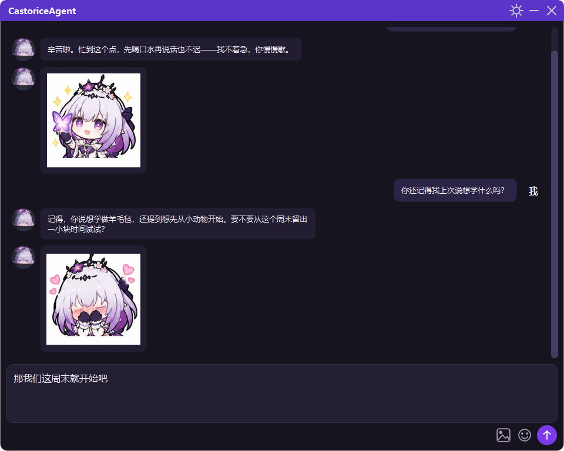
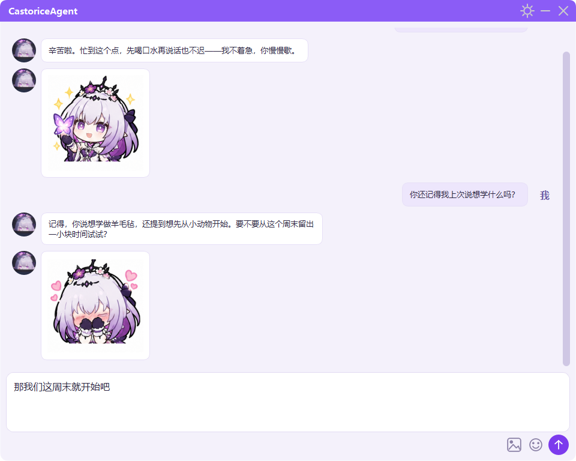

<div align="center">

# CastoriceAgent · 遐蝶

**一个跑在桌面上的 AI 陪伴助手**

不是网页聊天框的套壳，而是有性格、有情绪、记得住事的桌面伙伴。


[](LICENSE)

</div>

---

## 界面预览

| 深色（黑色偏紫） | 浅色（白色偏紫） |
| :---: | :---: |
|  |  |

---

## ✨ 特性

**🎭 完整的角色扮演系统**
角色设定拆成 11 个模块（人格核心、语气规则、世界观、人物关系、原作台词……），按触发词动态注入。
想换成别的角色？替换 `prompts/` 里的文件即可，不用改代码。

**💭 会看情绪发表情**
回复写完后，程序按情绪关键词从表情库里挑一张贴纸发出来——开心时不会发哭泣的图。
带概率与冷却控制，不会每条都刷表情。情绪匹配不上时也会从「温和表情」里随机兜底。

**🧠 记得住事，还知道是什么时候说的**
对话写进本地 ChromaDB 向量库，下次聊天自动检索相关记忆。
每条记忆都记着发生时间，所以它能说出「你上周提过……」而不只是「你提过……」。
每轮对话还会注入当前真实时间，问「现在几点」不用调用工具也能答对。

**🔧 能动手，不只动嘴**
内置 ReAct 工具循环：查询当前时间、联网搜索（支持 Bing / DuckDuckGo / Tavily / Serper / Bing API / 博查 六种后端，可自动降级）。

**🖼️ 能看懂图片**
换到视觉模型后，输入区会出现「图片」按钮。选好的图先挂在输入框上方，可以配文字一起发。
图片自动压缩到合适尺寸再上传，省 token。

**🎨 认真做的界面**
无边框圆角窗口、自绘按钮图标、流式打字机输出、消息淡入展开动画、平滑滚动。
深浅两套配色（都偏紫），默认跟随系统，右上角齿轮里随时切换。

**⚙️ 独立的设置窗口**
不用手动编辑 `config.yaml`——在设置里换提供商、填 API Key、改模型、选主题。
保存时会写回配置文件，**原有注释和排版一字不动**。

**📦 一条命令打包**
`打包.ps1` 一键生成可直接分发的文件夹版程序，发布包里的配置是占位的，不含你的任何密钥。

---

## 🚀 快速开始

### 环境要求

- **Python 3.9+**（开发环境为 3.13）
- **Windows**（界面基于 PySide6，理论上跨平台，但未在 Linux/macOS 上测试）

### 1. 获取代码

```bash
git clone https://github.com/Ky-l0r/CastoriceAgent.git
cd CastoriceAgent
```

### 2. 安装依赖

```bash
pip install -r requirements.txt
```

或者直接运行附带脚本：

```bash
python requirement_install.py
```

### 3. 填 API Key

首次启动时若没有 `config.yaml`，程序会自动根据 `example_config.yaml` 生成一份。
然后有两种方式填 Key：

**方式一：在软件里填（推荐）**

启动后如果检测到 Key 还是占位符，程序会**自动弹出设置窗口**并给出提示，填完点保存即可。

**方式二：直接编辑 config.yaml**

```yaml
active_provider: "deepseek"     # 选一个用

providers:
  deepseek:
    api_key: "sk-你的密钥"
    base_url: "https://api.deepseek.com"
    model: "deepseek-chat"
    temperature: 0.7
```

任何**兼容 OpenAI 接口**的服务都能用（OpenAI、DeepSeek、通义千问、月之暗面、本地 Ollama……）。

### 4. 运行

```bash
python main.py
```

想先看界面不接 API？直接运行 `python ui.py`，会用内置的模拟 AI 演示界面效果。

---

## 🎮 使用说明

| 操作 | 说明 |
| :--- | :--- |
| **发送消息** | `Enter` 发送，`Shift + Enter` 换行 |
| **发表情包** | 点输入框旁的笑脸按钮，选中后插入输入框，可继续补文字 |
| **发图片** | 点图片按钮选图，图片会挂在输入框上方（点 × 移除），可配文字一起发 |
| **切换主题** | 右上角齿轮 → 外观 → 跟随系统 / 浅色 / 深色 |
| **复制消息** | 鼠标直接拖选文字即可 |
| **最小化 / 关闭** | 右上角标题栏按钮；窗口可按住标题栏拖动 |

> 💡 图片功能需要**视觉模型**。程序会按模型名自动判断（`*-vl`、`gpt-4o`、`claude-3` 等视为视觉模型），
> 也可以在「设置」里手动勾选。

---

## ⚙️ 配置详解

`config.yaml` 主要分四块：

### 模型提供商

```yaml
active_provider: "deepseek"      # 当前用哪个

providers:
  deepseek:
    api_key: "sk-..."
    base_url: "https://api.deepseek.com"
    model: "deepseek-chat"
    temperature: 0.7
    vision: false                 # 是否支持图片输入；不填则按模型名自动判断
```

### 表情包

```yaml
emoji:
  enabled: true          # 总开关
  probability: 0.35      # 发出概率，0.35 ≈ 三成回复带表情
  cooldown_turns: 0      # 发过一次后至少隔几轮
  max_per_session: 0     # 每次启动最多发几张，0 为不限
  moods: {}              # 标签 → 心情描述（留空用内置）
  keywords: {}           # 标签 → 心情关键词（留空用内置）
```

### 联网搜索

```yaml
search:
  provider: "bing_html"  # bing_html / ddg_html / tavily / serper / bing_api / bocha / auto
  api_key: ""            # 用付费后端时填（也可用环境变量 SEARCH_API_KEY）
  max_results: 5
  fetch_content: true    # 是否抓取网页正文（让模型拿到摘要而非只有链接）
  fetch_top_n: 2
```

前两种是免费免密钥的网页搜索，`auto` 会依次尝试并在失败时自动降级。

---

## 📦 打包为 exe

在项目目录下执行：

```powershell
pwsh -File 打包.ps1
```

产物在 `发布包\CastoriceAgent\`，整个文件夹拷给别人就能用。

脚本已经排除了 `torch`、`scipy`、`pandas`、`transformers` 这几个 **chromadb 声明里没有、运行时也不导入**的依赖——
它们是被 `--collect-all` 连带收进来的，其中 `torch_cpu.dll` 单个文件就有 291MB。排除后发布包从 871MB 降到 **336MB**。

---

## 📁 项目结构

```
CastoriceAgent/
├── main.py                  程序入口：环境准备、日志、首次使用引导
├── ui.py                    界面：主窗口、设置窗口、气泡、表情面板、动画
├── ai.py                    AI 核心：配置、记忆库、提供商适配、工具、表情包
├── requirement_install.py   依赖安装脚本
├── requirements.txt         依赖清单
├── 打包.ps1                 一键打包脚本
├── 使用说明.txt              给最终用户的说明书
├── example_config.yaml      配置模板（发布时用它占位）
├── config.yaml              你的实际配置（已被 .gitignore 忽略）
├── prompts/                 角色设定（11 个模块）
├── Image/
│   ├── CastoriceAvatar.jpeg 聊天头像
│   └── 表情包/              表情贴纸，文件名即表情名
├── database/                对话记忆库（自动生成）
└── logs/app.log             运行日志
```

---

## 🧩 自定义

### 换成别的角色

`prompts/` 里的 `.md` 会按文件名顺序拼接成系统提示词。想换成自己的角色，改这几个文件即可：

| 文件 | 作用 |
| :--- | :--- |
| `identity.md` | 角色定位与工作边界 |
| `soul.md` | 人格核心：她是谁、怎么说话、如何表达情感 |
| `tone-rules.md` | 语气规则 |
| `system.md` / `talk_system.md` | 系统规则 |
| `world.md` / `story.md` / `characters.md` | 世界观、经历、相关人物（按触发词注入） |
| `canon_quotes.md` | 原作台词，用来校准说话风格 |
| `appellation.md` | 称谓统一映射 |

最省事的做法：只改 `identity.md` 和 `soul.md`，其余留空或删除。

### 加自己的表情包

1. 把图片（png / jpg / webp / gif）丢进 `Image/表情包/`，**文件名就是表情名**，例如 `开心.png`
2. 想让它在合适情绪下被选中，在 `ai.py` 的 `DEFAULT_EMOJI_KEYWORDS` 里补上关键词，
   或在 `config.yaml` 的 `emoji.keywords` 里配置（会覆盖内置值）：

```yaml
emoji:
  keywords:
    开心: ["开心", "高兴", "太好了", "哈哈"]
```

不配也能用，只是会走随机兜底。

---

## ❓ 常见问题

<details>
<summary><b>发消息报 401 / 鉴权失败</b></summary>

API Key 没填或填错了。打开右上角设置重新填写。
</details>

<details>
<summary><b>提示模型不存在</b></summary>

模型名写错了。到服务商官网查准确的模型名（如 DeepSeek 的 `deepseek-chat`），在设置里改「模型」一栏。
</details>

<details>
<summary><b>回复很慢或没反应</b></summary>

先看 `logs/app.log`。如果卡在网络请求，检查 `base_url` 是否能正常访问。
</details>

<details>
<summary><b>怎么清空聊天记忆</b></summary>

删掉 `database/` 目录，下次启动会自动重建空库。
</details>

<details>
<summary><b>AI 为什么有时候不发表情包</b></summary>

这是故意的。默认约三成概率附带表情，避免每条都刷图。
想调高就把 `emoji.probability` 改成 `0.8`，或设成 `1.0` 让它每条都发。
</details>

<details>
<summary><b>打包后的程序启动慢</b></summary>

文件夹模式首次启动约 2~5 秒（要加载 onnxruntime 等库）。如果换成了单文件模式，每次启动都要解压到临时目录，会慢很多，不建议。
</details>

---

## 🙏 致谢

- 界面基于 [PySide6](https://doc.qt.io/qtforpython/)（Qt for Python）
- 记忆检索使用 [ChromaDB](https://www.trychroma.com/)
- 模型调用通过 [OpenAI Python SDK](https://github.com/openai/openai-python) 的兼容接口
- 角色「遐蝶 / Castorice」出自游戏《崩坏：星穹铁道》，**版权归米哈游所有**

---

## 📄 许可

本项目**源代码与文档**采用 [MIT License](LICENSE) 开源，你可以自由使用、修改、分发，只需保留版权声明。

不过有一点需要留意：**仓库里的角色素材不在 MIT 授权范围内**——

| 内容 | 授权情况 |
| :--- | :--- |
| `ai.py`、`ui.py`、`main.py` 等源码，`README.md`、`打包.ps1` 等文档脚本 | MIT，自由使用 |
| `prompts/` 中转述游戏角色设定与原作台词的文本 | 出自《崩坏：星穹铁道》，版权归米哈游 / HoYoverse |
| `Image/` 下的头像与表情包图片 | 同上 |

这些素材仅用于**个人非商业的学习与同人用途**。如果你想二次分发，或者要把它用于商业场景，
请自行替换成自己的角色设定与图片素材——程序结构上是完全支持的（见上方「自定义」章节）。

> `LICENSE` 文件为纯 MIT 标准文本，以便 GitHub 正确识别许可证类型；
> 关于第三方素材的边界说明以本节为准。
